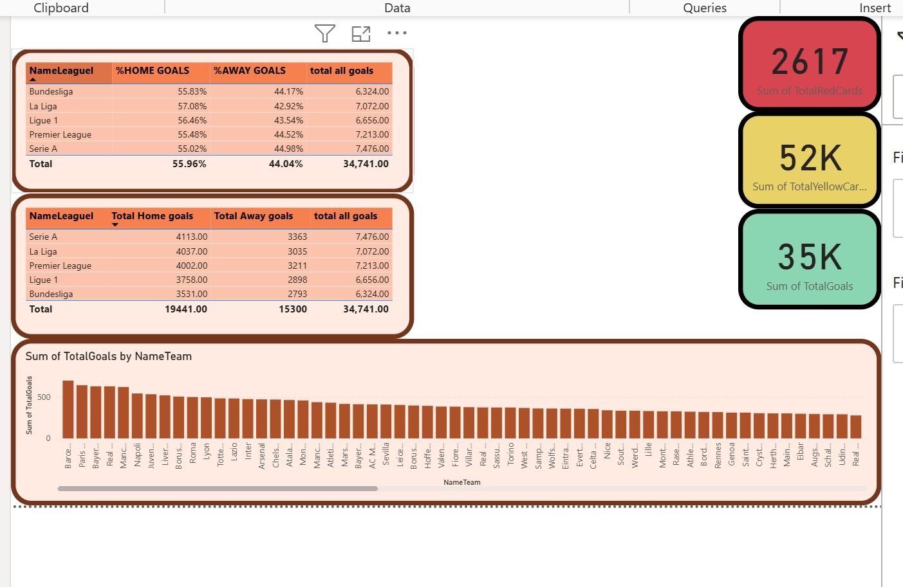
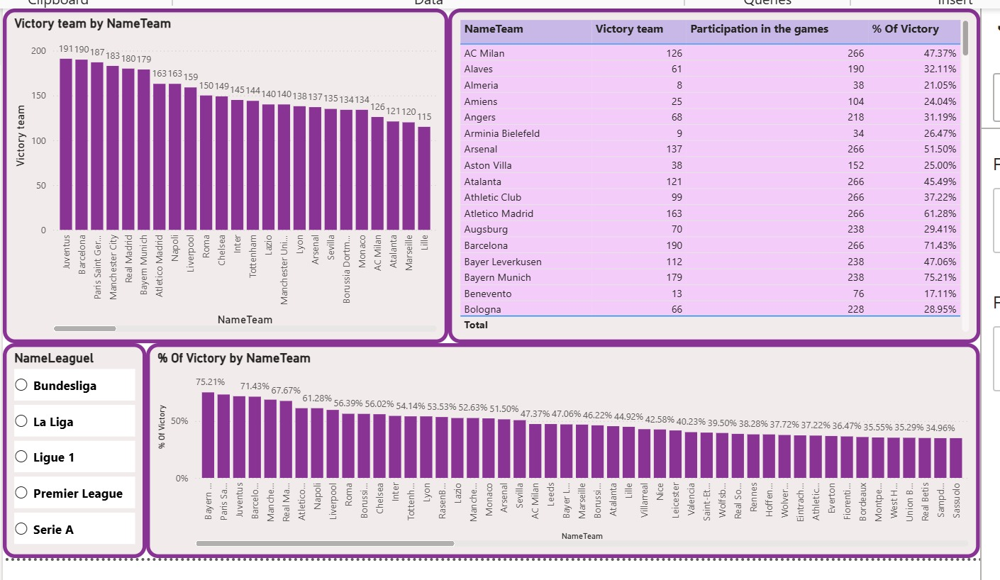
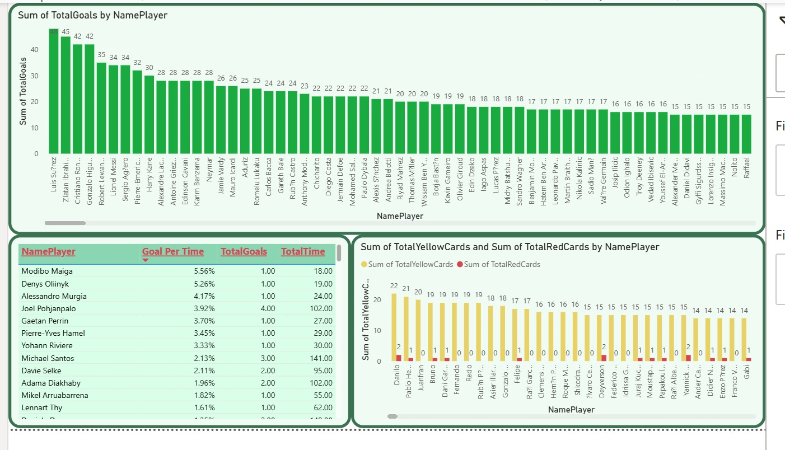
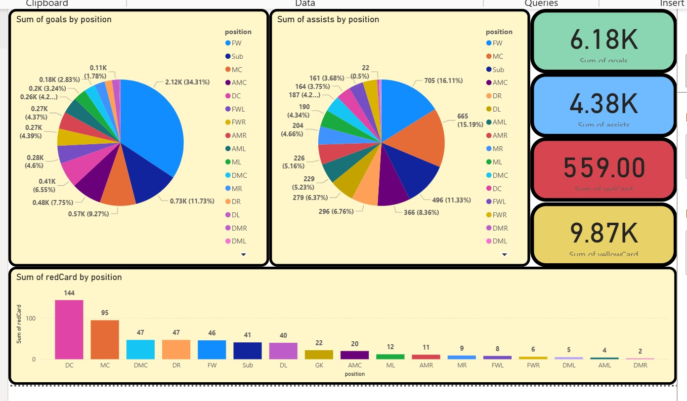

# Football BI Analytics Dashboard

Interactive Power BI dashboard for analyzing football data across major European leagues.

## Project Overview
This project presents a Business Intelligence dashboard built in Power BI to analyze football performance data across multiple European leagues.

The dashboard allows users to explore:
- Team performance
- Player statistics
- Goals and cards analysis
- Performance by player position

## Tools Used
- Power BI
- DAX
- Data Modeling
- Data Warehouse (Fact & Dimension tables)

## Dashboard Pages

### Goals & Cards Analysis

### Teams Performance

### Players Analysis

### Position Statistics

